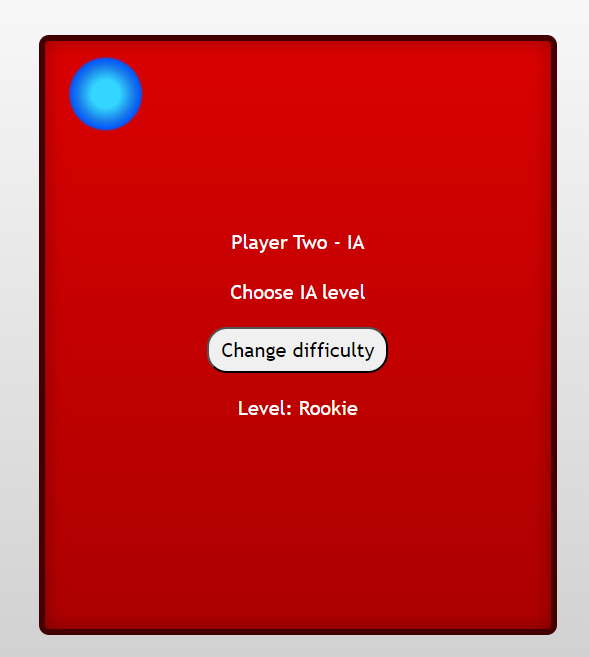
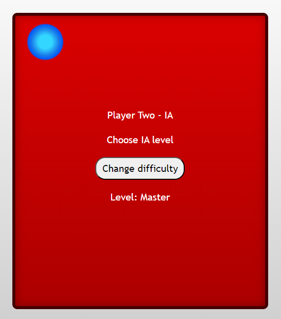
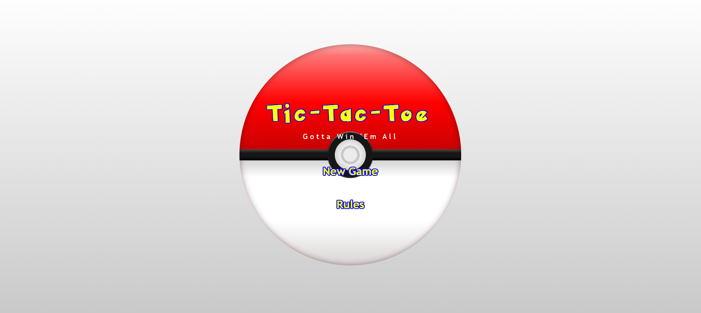
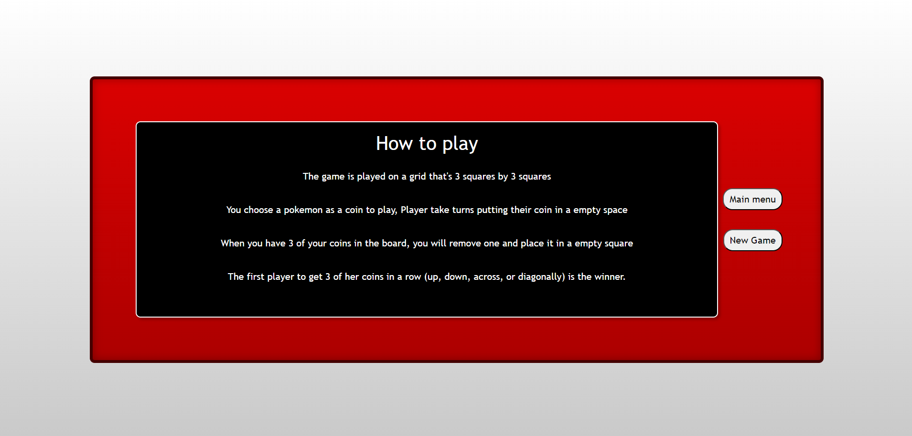
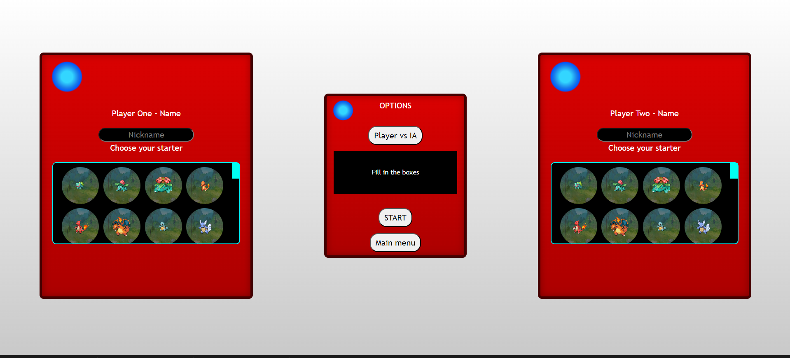
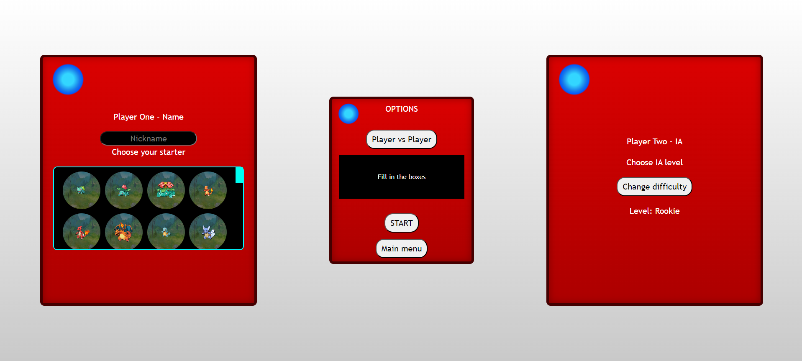
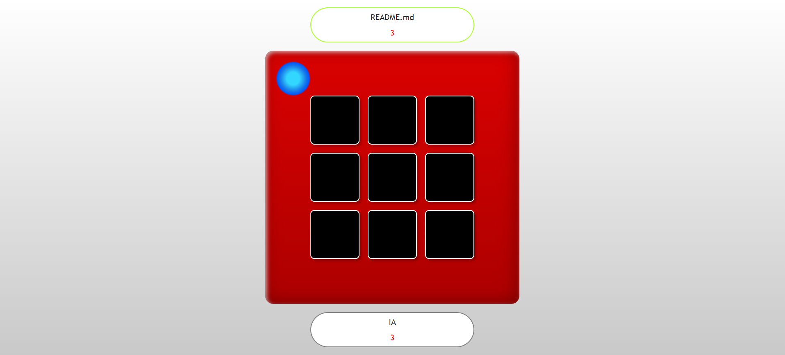
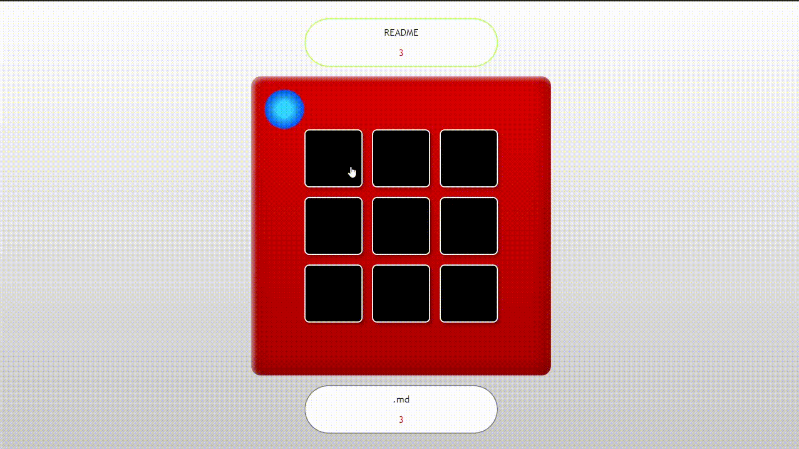
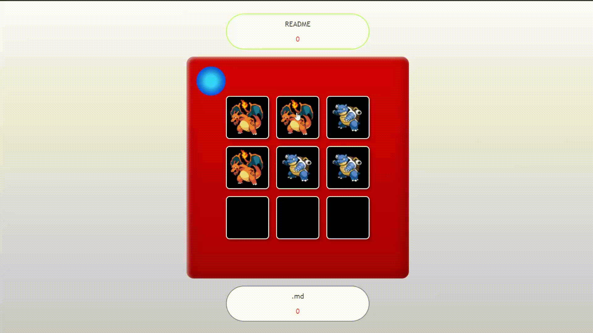

# Tic Tac Toe - Pokemon version #

- **Author:** Héctor Ginory Alemán
- **Tecnologies:**  HTML5, CSS3, JavaScript - ES6, Git

<a href="https://hectorginory.github.io/TicTacToe/">Click here to see the deploy.</a>
## Challenge ##
The challenge was to create a program that allows us to play
tic tac toe against a human opponent or against the machine.

### Objectives ###
- The user must be able to start a new game by entering their
name and choosing the game mode (human vs human or human vs
machine).
- When starting a new game, a 3x3 board will be created with the values
default.
- When a new game start, a side panel will be created with the
information about the players (whose turn it is to move and how many pieces they
remain).
- Each player can have a maximum of three tokens in play.
- If all six tiles are in play the user has to select one
position occupied by one of his pieces to change its position to
a new position.
- You can only place tiles on free positions.
 
Checking up the objectives, the minimum amount of views will be:
- Home view
- Player selection view
- Board game view
- Winner view

## How i made it ##

First of all I started creating all the logic behind the game, so all the objectives were done.

Once i finished all the objectives it was time to start creating the "AI".

Tha AI is based in call the functions i created for a human to play but depends of it level, it will play better or not.

If you place the level at "Rookie" the AI will play by trying to place, in a random place.

 

If you place the level at "Master" the AI will check all the posibilities in a fake board, if it place his coin in a empty space, by a loop. In case that it can win, it will place the coin in that place. If not it will check it with your coin so it wont let you win.

 

Once all the program was donde it was time to create the views.

I started by looking for a theme for the game. So I pick Pokemon to be theme.

I created the main menu view, by using css to create the pokeball.

Before you start to play you can check the rules in a extra view I made.

Then i create the player selection view, I made use of the <a href="https://pokeapi.co/">PokeAPI</a> to create the coin that the player will choose for playing the game.

### PVP View ###

### PVE View ###

You must fil the boxed and get a coin to start the game.

## Game view ##
Once you start a game you will see the game view, you can see the turns of each player. 

To play you must do click in the boxes so the coin will be placed in that place.

And you can remove doing the same.

## Victory view ##

If you want to see the victory view why dont you<a href="https://hectorginory.github.io/TicTacToe/">try it?</a>